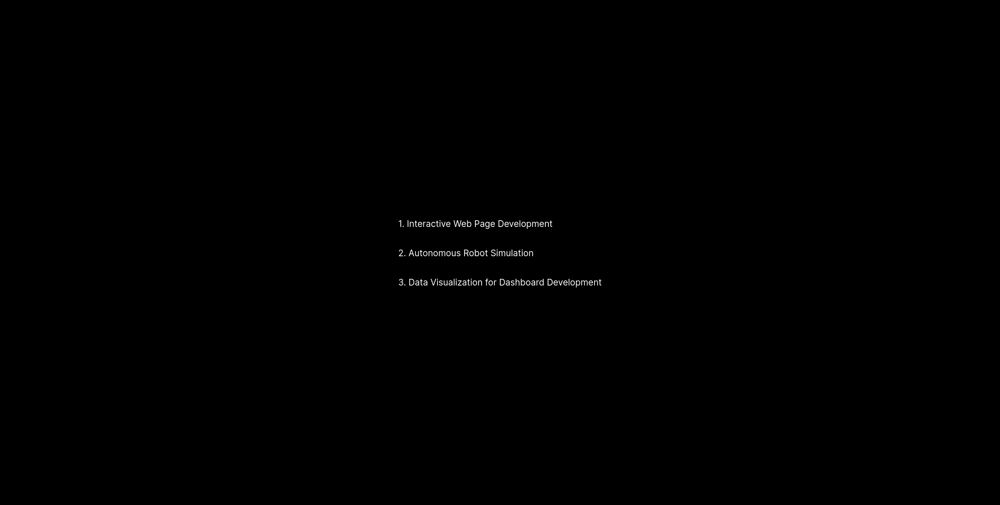
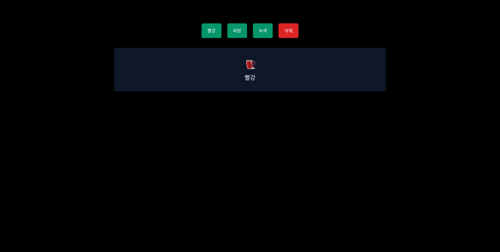
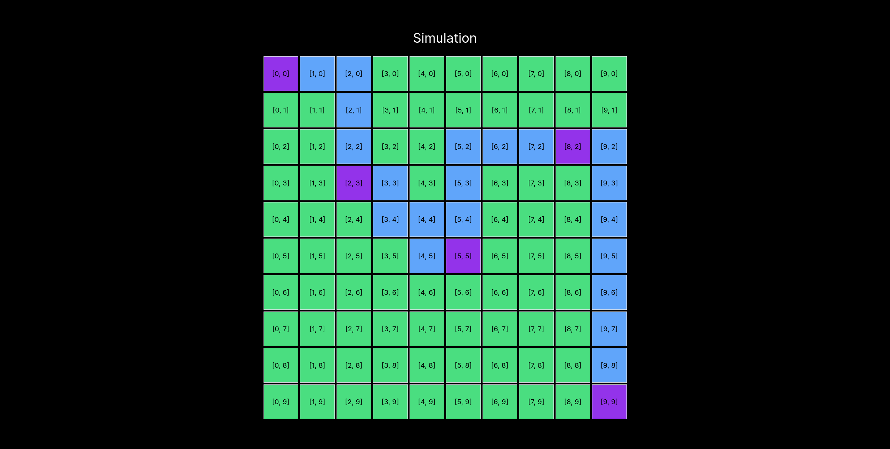
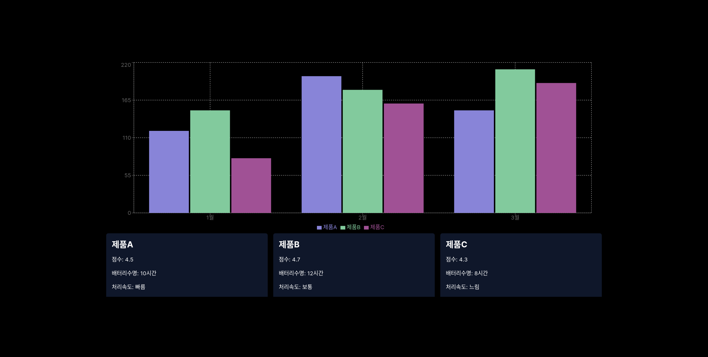

# 알지티 코딩 과제

## 페이지 라우팅

```tsx
/product-page // interactive web page

/simulation // robot simulation

/dashboard // dashboard
```

## 기술 스택

- Typescript
- Next.js
- tailwindcss
- recharts (Charts / Visualization)
- pathfinding.js (Robot simulation)

## How to run locally

1. Download & Unzip the folder or Clone from github

```bash
git clone https://github.com/devldm/rgt.git
```

2. Install dependencies

```bash
npm install
```

3. Run the project

```bash
npm run dev
```

4. Navigate to [localhost](http://localhost) in browser

```bash
http://localhost:3000
```

## Screenshots

Navigation


Interactive Web Page Development


Autonomous Robot Simulation


Data Visualization for Dashboard Development

